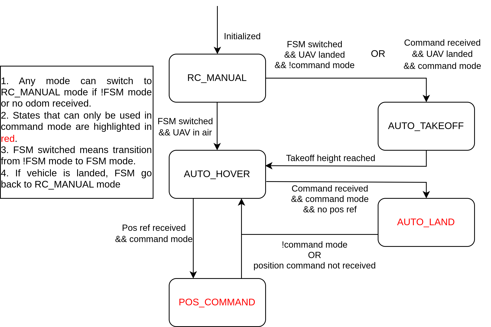

# AIRo Control Interface
This project provides a PX4 based quadrotor UAV control interfaces that supports customized outter-loop controllers. Currently supported controllers include Model Predictive Control (MPC), Backstepping Control (BS), and Sliding-Mode Control(SMC). By using this package you can achieve functions such as auto takeoff/land, RC transmitter control, and follow external trajectory commands with customized outter-loop controllers. The package can be used with both Gazebo simulation or real-world quadrotors with external positioning systems such as Vicon.

If you use this package in your research, please kindly cite the follow reference:
```
@article{jiang2022neural,
  title={Neural network based model predictive control for a quadrotor UAV},
  author={Jiang, Bailun and Li, Boyang and Zhou, Weifeng and Lo, Li-Yu and Chen, Chih-Keng and Wen, Chih-Yung},
  journal={Aerospace},
  volume={9},
  number={8},
  pages={460},
  year={2022},
  publisher={MDPI}
}
```

## Installation

It is recommanded to run the package in our docker following instructions [here](https://github.com/HKPolyU-UAV/airo_docker_lib). By doing so, you can skip the installation section.

**Prerequisities** 
* ROS ([ROS noetic](http://wiki.ros.org/noetic/Installation/Ubuntu) recommended)
* [QGroundControl](http://qgroundcontrol.com/)
* [MAVROS](http://wiki.ros.org/mavros)
* [Acados](https://docs.acados.org/installation/index.html)

First, install Acados at your home directory. If you want to install Acados at other directory, change the acados_include and acados_lib directory written in CMakeLists.txt of airo_control package, and also change ```~/acados``` in the following codes to your customized directory in the following codes.
```
cd ~
git clone https://github.com/acados/acados.git
cd acados
git checkout 568e46c
git submodule update --recursive --init
mkdir build
cd build
cmake -DACADOS_WITH_QPOASES=ON -DACADOS_WITH_OSQP=OFF/ON -DACADOS_INSTALL_DIR=~/acados ..
sudo make install -j4
```

Create a catkin workspace and clone this repository to src folder (ex. ~/airo_control_interface_ws/src)
```
mkdir -p ~/airo_control_interface_ws/src
cd ~/airo_control_interface_ws
catkin_make
cd src
git clone https://github.com/HKPolyU-UAV/airo_control_interface.git
```

Build the package.
```
cd ~/airo_control_interface_ws
catkin_make
```

Download and install the PX4 (1.11.0)
```
cd ~
git clone https://github.com/PX4/PX4-Autopilot.git
cd PX4-Autopilot/
git checkout 71db090
git submodule sync --recursive
git submodule update --init --recursive
bash ./Tools/setup/ubuntu.sh
sudo apt upgrade libignition-math4 #(libignition-math2 for melodic)
```

Add acados library path to ```.bashrc```, change ```<path_to_acados>``` to your path, e.g. ```/home/your_username```. Note that do not use ```~``` in ```<path_to_acados>```.
```
echo 'export LD_LIBRARY_PATH=$LD_LIBRARY_PATH:"<path_to_acados>/acados/lib"' >> ~/.bashrc
echo 'export ACADOS_SOURCE_DIR="<path_to_acados>/acados"' >> ~/.bashrc
```

Add source ```setup.bash``` file to ```.bashrc```.
```
echo 'source ~/airo_control_interface_ws/devel/setup.bash' >> ~/.bashrc
```

## Running Simulation

Start PX4 SITL
```
cd ~/PX4-Autopilot/
make px4_sitl_default gazebo
```

Run MAVROS
```
roslaunch airo_control mavros_gazebo.launch
```

Start control interface in new terminal
```
roslaunch airo_control fsm_gazebo.launch
```

Run an example mission
```
rosrun airo_control example_mission_node
```

Or, you can simply run start.sh in the startup folder.

## Usage with RC Transmitter

0. **Preparation**

First, launch mavros and QGC and make sure the quadrotor is connected. To use the transmitter in gazebo simulation, set PX4 parameter COM_RCIN_MODE to "RC and Joystick with fallback", connect RC transmitter via usb serial, calibrate the joysticks in "Joysticks" tab and you should be able to read channel inputs in QGC "Radio" tab. In QGC setup page, you only need to set emergency kill channel and flight mode channel. Three more RC channel will be used by the control interface, which are referred to as FSM channel (channel 5 by default), command channel (channel 6 by default), and reboot channel (channel 8 by default). The FSM channel controls if the interface is activated, the command channel controls if the interface follows external trajecdtory commands, and the reboot channel will reboot FCU so that it is recommended to be set to the stick that can automatically flip back. The channel is enabled if the pwm output is greater than the threshold (1750 by default).

After this you can launch the control interface by
```
roslaunch airo_control fsm_gazebo.launch
```
or
```
roslaunch airo_control fsm_vicon.launch
```
For vicon usage, make sure the vehicle can enter position flight mode before the mission.

The FSM will be initialized to ```RC_MANUAL``` state, where the control interface is not activated in this mode so that you have full control the quadrotor with the transmitter as usual. In general, it is recommended to use the control interface by choosing to enable or disable command channel before running the mission based on the application scenarios.  Although switching command channel during mission is supported, it is not required during common applications and could cause confusions. Therefore, we recommend the following two pipelines to work with this FSM. For more detailed introduction of the FSM please refer to the ```FSM Introduction``` section.

1. **Non-command Mode**

In this mode, you'll be controlling the vehicle with the transmitter joysticks. To use in non-command mode, first disable the command channel and then flip the FSM channel from disable to enable state (which will be referred to as switch FSM channel in the follow text).

Once the FSM channel is switched, the control interface will detect the vehilce state and act accordingly. If the vehicle is landed and disarmed, the vehicle will arm and accelerate motors for a few seconds and then automatically takeoff to desired height. Once takeoff height is reached, the vehicle will follow the joystick commands. If the vehicle is armed when hovering in the air, the FSM will directly follow joystick commands.

When vehicle is landed by joystick, the control interface will disarm the UAV and re-initiate for the next mission. 

2. **Command Mode**

In this mode, the control interface will follow external commands such as takeoff/land and trajectory setpoints. To use in command mode, first enable the command channel and then enable the FSM channel. Unlike the non-command mode, if the command channel is enabled, switching FSM channel will not automatically takeoff the vehicle.
Then the user can send takeoff trigger ```takeoff_land_trigger = true``` to topic ```/airo_px4/takeoff_land_trigger``` and the vehicle will takeoff to desired height. After auto takeoff, the vehicle will hover and publish indicator ```is_waiting_for_command = true``` to topic “/airo_px4/fsm_info" to indicate that the user can send trajectory commands to the control interface. Then, the vehicle will follow commands published to ```/airo_control/setpoint``` (or ```/airo_control/setpoint_preview``` if MPC preview is used). If you stop sending commands, the vehicle will hover at current position. After this you can land and disarm the vehicle by sending ```takeoff_land_trigger = false``` to the same topic.

## FSM Introduction

The control interface uses a finite state machine (FSM) to control the UAV with the detials introduced below.



1. **RC_MANUAL**

In this state, the FSM is disabled and the quadrotor operates at manual modes (i.e. position,altitude, and stabilize) using the embedded PID controllers in PX4 firmware. This is the only state that PX4 offboard is disabled and the user have full control over RC transmitter using the embedded PX4 controller. When vehicle is landed, you can use reboot channel to reboot the FCU.

The FSM is initialized with this state and will go back to it if the vehicle is disarmed, killed, lost connection, or localization message is timed-out. 

2. **AUTO_TAKEOFF**

In this state, the vehicle will perform auto takeoff operation. The vehicle will slowly accelerate motors for several seconds to warn others and then takeoff to ```takeoff_height``` at ```takeoff_land_speed```. This state can be entered from ```RC_MANUAL``` state in two conditions. First condition is if command channel is disabled && the vehicle is landed && the FSM channel is switched. Second condition is if command channel is enabled && FSM is enabled && takeoff trigger is received. Once the target height is reached, the FSM will enter ```AUTO_HOVER``` state. 

3. **AUTO_HOVER**

In this state, the vehicle will follow the commend of RC transmitter joysticks, which is similar to the PX4 position flight mode. This state can be entered after ```AUTO_TAKEOFF``` or if the FSM channel switched during manual flight using ```RC_MANUAL```. If the vehicle is landed with joystick commands, the FSM will disarm the vehicle and jump back to ```RC_MANUAL``` state. 

If command channel is enabled, the FSM will send ```is_waiting_for_command = true``` to topic ```/airo_px4/fsm_info``` to indicate that the vehicle is waiting for external commands. 

4. **AUTO_LAND**

In this state, the vehicle will automatically land and disarm at current x&y position. This state can only be entered when command channel enabled and land command is received.

5. **POS_COMMAND**

In this state, the vehicle will follow external position command subscribed from ```/airo_px4/setpoint``` (or ```/airo_control/setpoint_preview``` if MPC preview is used). This state can be entered from ```AUTO_HOVER``` mode if command channel enabled && position command is received.

Note that in all states, the position reference given to the controller is confined by the safety constraints set in ```.yaml``` file

## Parameters

1. **fsm.yaml**

```pose_topic```, ```twist_topic```: topics that publish pose & twist messages.

```controller_type```: choice of customized outter-loop controller, currently support ```mpc```, ```backstepping```, and ```slidingmode```.

```fsm_frequency```: running frequency of control interface and the outter-loop controller.

```state_timeout```, ```rc_timeout```, ```odom_timeout```, ```command_timeout```: timeout duration in seconds to decide whether the corresponding messages are received.

```motor_speedup_time```: duration in seconds to speedup motor before auto takeoff.

```reject_takeoff_twist_threshold```: reject auto takeoff if the vehicle twist is too high.

```hover_max_velocity```, ```hover_max_yaw_rate```: maximum translational speed (m/s) and yaw rate (rad/s) commanded by joysticks.

```safety_volumn```: min_x, max_x, min_y, max_y, and max_z in meters. Note that min_z is not confined.

```without_rc```: set to true if you want to use control interface without rc transmitter. If this set to true, the FSM channel and command channel are enabled by default and you can directly control the vehicle with external commands. If this set to false, the vehicle won't listen to external commands until the transmitter is connected.

The rest of the parameter list should be self-explanatory. Note that the channel number parameter corresponds to the number shown in QGC.

2. **mpc.yaml**

```tau_phi```, ```tau_theta```, ```tau_psi```: estimated inner loop dynamics for roll, pitch, and yaw

```diag_cost_x```, ```diag_cost_u```, ```diag_cost_xn```: diagnoal weight matrix for state, control input, and terminal state

3. **backstepping.yaml**

```k_x1```, ```k_y1```, ```k_z1```: position control gains for corresponding axis

```k_x2```, ```k_y2```, ```k_z2```: velocity control gains for corresponding axis

4. **slidingmode.yaml**
   
```k_xe```, ```k_ye```, ```k_ze```: position gains for corresponding axis

```k_xs```, ```k_ys```, ```k_zs```: sliding surface control gains for corresponding axis

```k_xt```, ```k_yt```, ```k_zt```: tanh function parameters for corresponding axis

## Advanced Usage

We've developed another package named by [airo_trajectory](https://github.com/HKPolyU-UAV/airo_trajectory) based on this control interface. The package provides a trajectory server to command the vehicle to takeoff/land or follow certain trajectories such as fixed points or polynomial trajectories defined within ```.txt``` file.

## Generate MPC Solver

The python scripts used to generate MPC solver is included in ```~/airo_control_interface_ws/src/airo_control_interface/airo_control/acados_scripts/quadrotor_model.py```. If you want to make modifications and generate MPC solver by your own, follow these instructions.

Install python 3.7
```
sudo add-apt-repository ppa:deadsnakes/ppa
sudo apt update
sudo apt install python3.7
```

Install python dependencies
```
python3 -m pip install pip
sudo pip3 install numpy matplotlib scipy future-fstrings casadi>=3.5.1 setuptools
sudo apt-get install python3.7-tk
pip install -e ~/acados/interfaces/acados_template
```

Generate solver, note that for the first run, you should setup Tera renderer automatically by following the instructions.
```
cd ~/airo_control_interface_ws/src/airo_control_interface/airo_control/acados_scripts
python3 generate_c_code.py
```

## MPC System Identification

To use the control framework with MPC, the quadrotor model parameters should first be identified, which includes hover thrust and inner control loop dynamics for pitch, roll, and yaw movements. In order to do this, first make sure that the quadrotor can be used in position flight mode, then launch ```system_id.launch``` in ```airo_control``` package. The quadrotor will automatically takeoff, perform maneuvers in all axes, and land. Once it's landed, the identified parameters will be displayed in terminal and you can save it in ```.yaml``` file by input ```y```.
