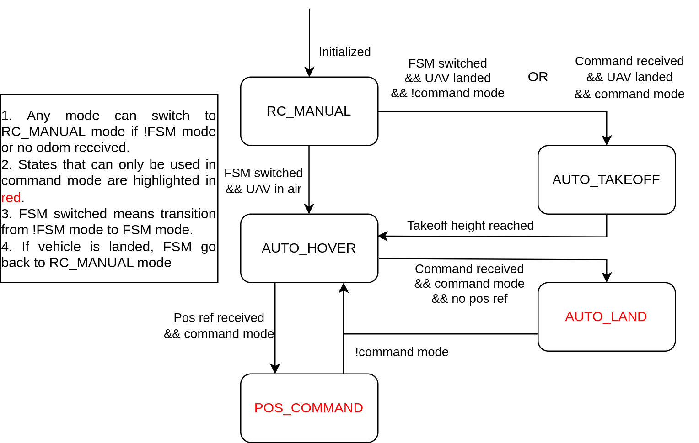

# AIRo PX4 Framework
This project focuses on PX4 support with customized outer-loop position controller.  

## Prerequisites
* ROS ([ROS noetic](http://wiki.ros.org/noetic/Installation/Ubuntu) recommended)
* [QGroundControl](http://qgroundcontrol.com/)
* [MAVROS](http://wiki.ros.org/mavros)

## Installation

Create a catkin workspace and clone this repository to catkin src folder (ex. ~/catkin_ws/src)
```
mkdir -p ~/catkin_ws/src
cd ~/catkin_ws/
catkin_make
cd src
git clone https://github.com/HKPolyU-UAV/airo_px4.git
cd ~/catkin_ws
catkin_make
```

Download and install the PX4 (1.11.0)
```
cd ~
git clone https://github.com/PX4/PX4-Autopilot.git
cd PX4-Autopilot/
git checkout 71db090
git submodule sync --recursive
git submodule update --init --recursive
bash ./Tools/setup/ubuntu.sh
sudo apt upgrade libignition-math4 #(libignition-math2 for melodic)
```

## Hardware Setup

In QGC setup, only set emergency kill switch and flight mode switch channel. To use the framework in simulation, set parameter COM_RCIN_MODE to "RC and Joystick with fallback", connect RC transmitter via usb serial, calibrate the joysticks in "Joysticks" tab and you should be able to read channel inputs in QGC "Radio" tab.

If the pwm output of the switch channel is greater than the threshold (1750 by default), the channel is called enabled. Apart from the kill switch and flight mode channels, three more channels will be used by the framework. First channel is referred to as FSM channel with default value set to channel 5. The FSM channel is called switched if it is changed from disable state to enable state.  Second channel is referred to as command channel with default value set to channel 6. Third channel is referred to as reboot channel with default value set to channel 8 and is recommended to set to the channel that can automatically flip back.

## FSM Introduction



1. RC_MANUAL 

In this state, the FSM is disabled and the quadrotor operates at manual modes (i.e. position,altitude, and stabilize) using the embedded PID controllers in PX4 firmware. The FSM is initialized with this state and will go back to it every time the vehicle is disarmed. This is the only state that PX4 offboard is disabled and the user have total control over RC transmitter using the embedded controller in FCU. 

2. AUTO_TAKEOFF 

In this state, the vehicle will perform auto takeoff operation. The vehicle will slowly accelerate motors for several seconds and then takeoff to takeoff_height at takeoff_land_speed. This state can be triggered from RC_MANUAL state in two conditions. First condition is if command channel is disabled, the vehicle is landed, and the FSM channel is switched. Second is if command channel is enabled, FSM is enabled, and takeoff trigger is received. Once the target height is reached, the FSM will jump to AUTO_HOVER state. 

3. AUTO_HOVER 

In this state, the vehicle will follow the commend of RC transmitter joysticks, which is similar to the position flight mode. This state can be triggered after AUTO_TAKEOFF or if the FSM channel switched during manual flight using RC_MANUAL. User can set a safety volume to confine the vehicle position. If the vehicle is landed with joystick commands, the FSM will disarm the vehicle and jump back to RC_MANUAL state. 
If command channel is enabled, the FSM will send "is_waiting_for_command = true" to topic "/airo_px4/fsm_info" to indicate that the vehicle is waiting for external commands. 

4. AUTO_LAND 

In this state, the vehicle will automatically land and disarm at current x&y position. This state can only be triggered when command channel enabled and land command is received. 

5. POS_COMMAND 

In this state, the vehicle will follow external position command subscribed from “/airo_px4/setpoint“.

## Usage

1. Preparation 

Before using the FSM, make sure the vehicle can be used with position flight mode. Then, run the system identification program to determine the hover_thrust, tau_phi, and tau_theta. After this, the FSM should be ready to rock. When vehicle is landed, you can use reboot channel to reboot the FCU. 
In general, it is recommended to choose to enable or disable command channel before running the FSM based on the application scenarios.  Although switching command channel during mission is supported, it is not required during common applications and could cause confusions. Therefore, we recommend the following two pipelines to work with this FSM. 

2. Non-command Mode

To use in non-command mode, first disable the command channel and then switch the FSM channel. The FSM will ask the user to center all joysticks to avoid sudden position change when jump to AUTO_HOVER state. Then, the vehicle should arm and accelerate motors for a few seconds and automatically takeoff to desired height. Once takeoff height is reached, the vehicle will follow the joystick commands. If vehicle has been landed, the FSM will disarm it and reinitiate for the next mission. 

3. Command Mode 

To use in command mode, first enable the command channel and then enable the FSM channel. Then the user can send takeoff trigger to topic “/airo_px4/takeoff_land_trigger“. After auto takeoff, the FSM will publish indicator to topic “/airo_px4/fsm_info“. Note that the command mode is capable to be used without RC transmitter. 

## Running Simulation

Start PX4 SITL
```
cd ~/PX4-Autopilot/
make px4_sitl_default gazebo
```

Run MAVROS
```
cd ~/catkin_ws/
roslaunch airo_px4 px4_gazebo.launch
```

Start AIRo PX4 FSM
```
roslaunch airo_px4 airo_px4_fsm.launch
```

Run example mission node
```
rosrun airo_px4 example_mission_node
```
